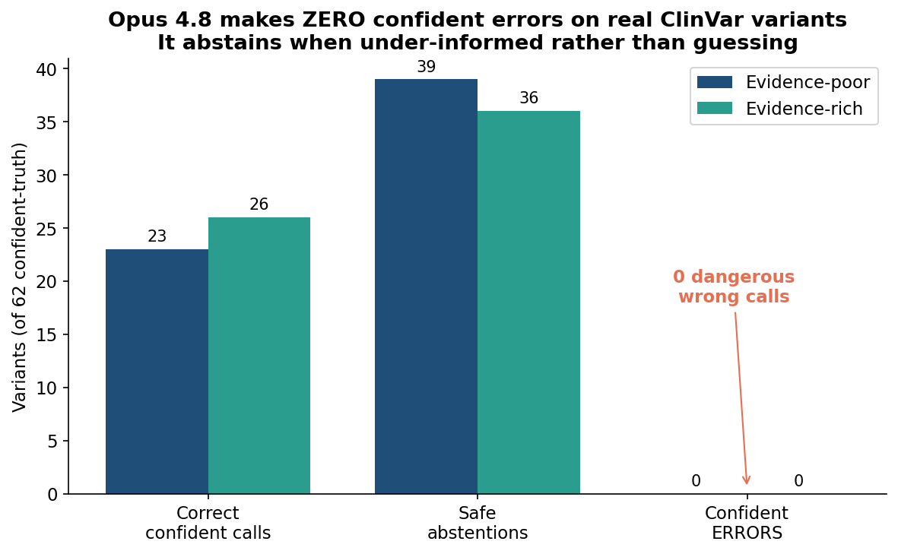
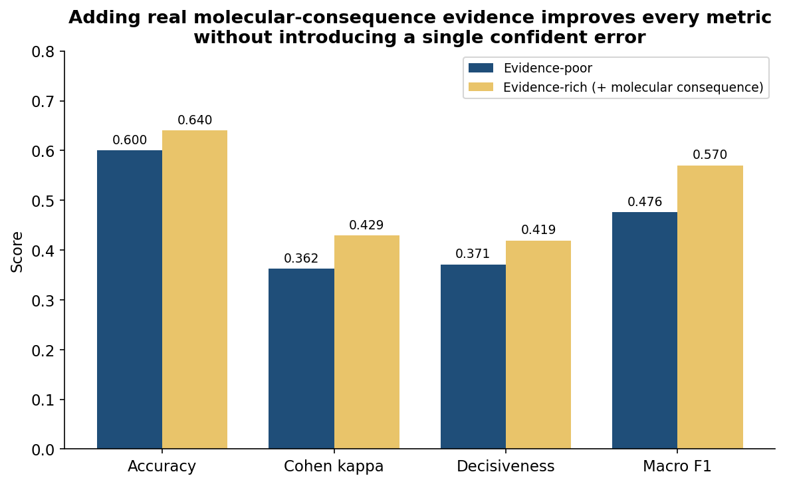
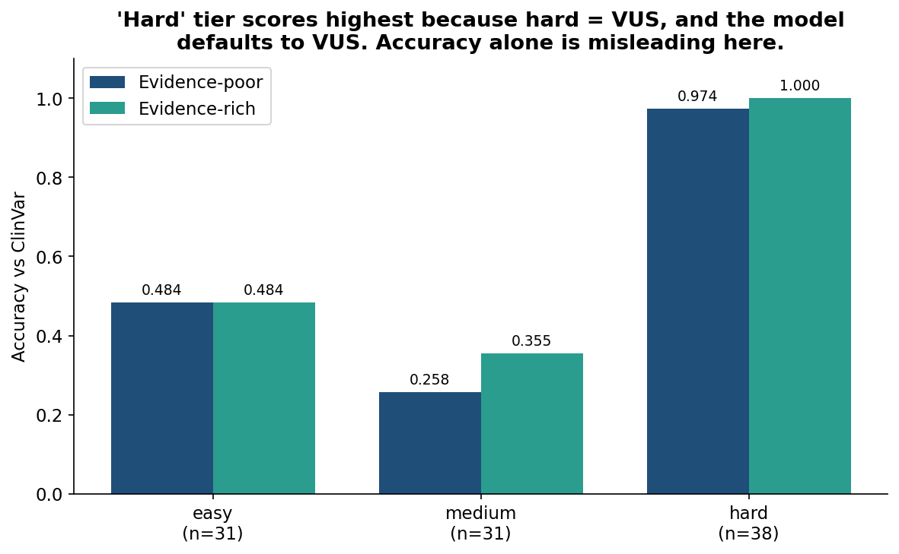
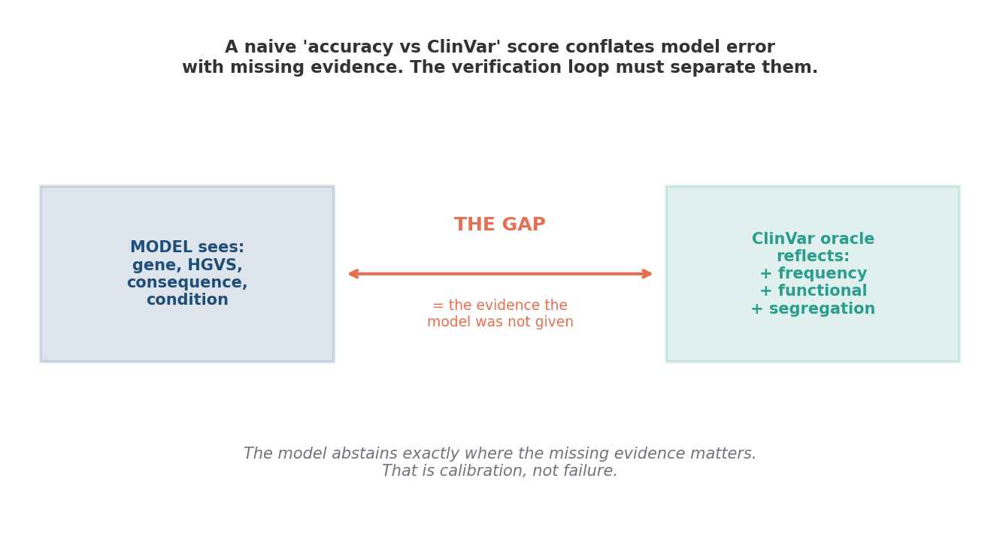

# clinvar-interpretation-benchmark

> **A verification loop for LLM variant interpretation. It scores a frontier model's germline-variant classifications against ClinVar's expert-consensus oracle, checks whether the model's biological reasoning holds up, and measures the effect of supplying real ACMG evidence. Built because, in the words of the role it was made for, "we can't trust models until we understand their accuracy."**

[](https://github.com/gbadedata/clinvar-interpretation-benchmark/actions/workflows/ci.yml)
[](https://www.python.org/downloads/)
[](#testing)
[](LICENSE)

This project evaluates whether a frontier large language model can be trusted to interpret clinical genetic variants. It does not stop at an accuracy number. It separates safe behaviour (abstaining when evidence is insufficient) from dangerous behaviour (confident wrong calls), checks the model's reasoning with biological validators, and runs a controlled experiment on what happens when real ACMG evidence is added to the prompt.

**Headline finding (Claude Opus 4.8, 100 real ClinVar variants, two evidence conditions, 200 interpretations):** the model made **zero confident errors**. It never once flipped pathogenic and benign. When it lacked sufficient evidence it abstained to "uncertain" rather than guessing, exactly the behaviour a clinical decision loop requires. Adding real molecular-consequence evidence raised accuracy from 0.600 to 0.640 and decisiveness from 0.371 to 0.419 without introducing a single error.

---

## Table of contents

- [Why this exists](#why-this-exists)
- [The headline result](#the-headline-result)
- [Figures](#figures)
- [What the benchmark does](#what-the-benchmark-does)
- [The oracle: ClinVar's expert-consensus stars](#the-oracle-clinvars-expert-consensus-stars)
- [Three scoring layers](#three-scoring-layers)
- [The evidence experiment](#the-evidence-experiment)
- [Interpreting the results](#interpreting-the-results)
- [Quick start](#quick-start)
- [Architecture](#architecture)
- [Engineering challenges](#engineering-challenges)
- [Limitations](#limitations-and-future-work)
- [Testing](#testing)
- [Project structure](#project-structure)
- [References](#references)

---

## Why this exists

Frontier models are increasingly used to interpret genetic variants in target discovery and clinical decision support. The problem is trust: unlike code or maths, verifying a biological interpretation is hard and normally requires expert consensus. A model can produce a confident, fluent, completely wrong classification, and in a clinical loop that is dangerous.

This benchmark builds the verification loop. It asks four questions that a naive accuracy score cannot answer:

1. When the model is confident, is it right?
2. When it is wrong, is it *dangerously* wrong (a confident misclassification) or *safely* wrong (an honest abstention)?
3. Is the model's biological reasoning sound, or did it reach a right answer for a wrong reason, or fabricate evidence?
4. How much does the model's reliability depend on the evidence it is given?

The design philosophy, an oracle, hidden-answer evaluation, calibrated difficulty tiers, independent validators, and honest documentation of limitations, is the same evaluation-design pattern that distinguishes a benchmark from a demo.

---

## The headline result

Claude Opus 4.8, 100 real ClinVar variants (2-star-and-above expert consensus), each interpreted twice (evidence-poor and evidence-rich), 200 total interpretations:

| Metric | Evidence-poor | Evidence-rich | Reading |
|---|---|---|---|
| **Confident errors** | **0** | **0** | Never a dangerous wrong call |
| **Safe rate** | **1.000** | **1.000** | Always avoided confident misclassification |
| Overall accuracy | 0.600 | 0.640 | Evidence helped |
| Cohen's kappa | 0.362 | 0.429 | Agreement improved |
| Decisiveness | 0.371 | 0.419 | Evidence made it commit more |
| Macro F1 | 0.476 | 0.570 | Improved |

Biological validators (reasoning quality): gene grounding **1.000**, no-fabrication **1.000 / 0.970** (poor / rich), consequence consistency **0.850 / 0.920**, mechanism plausibility **1.000**.

The single most important number is the one that did not move: **zero confident errors in either condition.**

---

## Figures

### The safety result
Across 62 confident-truth variants, Opus made correct calls or safe abstentions, and zero confident errors. It defers rather than guesses.



### The evidence effect
Supplying the real molecular consequence (derived from the variant's own HGVS, the highest-weighted ACMG criterion) improved every metric without introducing an error.



### Why per-tier accuracy is misleading on its own
The "hard" tier scores highest, which looks backwards until you see why: hard-tier variants are predominantly VUS, and the model defaults to VUS, so it "agrees" with the oracle for the wrong reason. This is exactly why the benchmark reports abstention separately from raw accuracy.



### What the model-vs-oracle gap actually measures
The model sees gene, HGVS, consequence, and condition. ClinVar's classification reflects far more: population frequency, functional assays, segregation. The gap between them is not simply "model error", it is the evidence the model was never given.



---

## What the benchmark does

For each variant, the model receives structured context (gene, HGVS coding and protein change, molecular consequence, associated condition) and must return strict JSON: a three-class classification (pathogenic / benign / uncertain), the gene it believes is involved, the molecular consequence, the disease mechanism, its reasoning, and the evidence types it relied on.

The benchmark then scores that response on three independent layers and, optionally, repeats the whole evaluation with additional ACMG evidence supplied, to measure the evidence effect.

---

## The oracle: ClinVar's expert-consensus stars

ClinVar assigns every variant a review status on a four-star scale that *is* an expert-consensus hierarchy:

| Stars | Review status | Used as oracle? |
|---|---|---|
| 4 | Practice guideline | Yes (highest confidence) |
| 3 | Reviewed by expert panel | Yes |
| 2 | Criteria provided, multiple submitters, no conflicts | Yes (consensus) |
| 1 | Criteria provided, single submitter | No (low confidence) |
| 0 | No assertion criteria | No |

By restricting the oracle to 2-star-and-above, the ground truth is genuine multi-laboratory expert consensus, not a single opinion. This is the "expert consensus loop" that high-stakes interpretation requires, formalised directly from ClinVar's own confidence signal.

---

## Three scoring layers

### Layer 1 — Oracle agreement
Accuracy, per-difficulty-tier accuracy, per-class precision/recall/F1, Cohen's kappa, and a 3x3 confusion matrix, comparing the model's classification to the ClinVar consensus.

### Layer 2 — Abstention analysis (the clinically meaningful layer)
Plain accuracy treats every non-match as failure. That is wrong for clinical interpretation, where abstaining under insufficient evidence is the *correct* behaviour. This layer separates three outcomes on confident-truth variants:

- **Correct call**: model matched the oracle's confident classification.
- **Confident error**: model made the *opposite* confident call (benign↔pathogenic). The safety-critical failure.
- **Safe abstention**: model returned "uncertain" where the oracle was confident. Under-informed, but safe.

It reports a **safe rate** (how often the model avoids a confident wrong call) and **decisiveness** (how often it commits at all). A model can be perfectly safe and barely decisive, and that distinction is invisible to accuracy alone.

### Layer 3 — Biological validators (reasoning quality)
Four checks run independently of the oracle, because a model can get the right label for the wrong reason:

- **Gene grounding**: did it name the gene actually carrying the variant?
- **Consequence consistency**: does its stated molecular consequence match the variant's actual consequence?
- **Mechanism plausibility**: for a loss-of-function variant called pathogenic, does the reasoning reflect a loss-of-function mechanism?
- **No-fabrication**: did it avoid inventing specific evidence (allele frequencies, gnomAD counts, citations, patient numbers, functional studies) that was never provided? The most safety-critical validator.

---

## The evidence experiment

The core experiment runs the same variants twice. **Evidence-poor** supplies only the bare context. **Evidence-rich** adds the real molecular consequence, derived directly from the variant's own HGVS nomenclature (frameshift, nonsense, canonical splice, missense, synonymous) plus an explicit note on its ACMG relevance (PVS1 for loss of function). Nothing is fabricated; the model is given the functional interpretation of nomenclature it was already shown.

The difference between the two conditions isolates the causal effect of evidence on model reliability. This is the heart of a verification loop: not just "how accurate is the model", but "what does the model need in order to be accurate, and does giving it that evidence make it more reliable or merely more confident?"

The answer here: the evidence made Opus modestly more accurate and more decisive, and it did so *safely*, with zero new errors. Evidence helped the model commit correctly rather than pushing it into overconfidence.

---

## Interpreting the results

The result is more interesting than a high accuracy score would have been, and it is honest about what it shows.

**Opus 4.8 is exceptionally safe and ACMG-rigorous.** Inspection of the model's actual reasoning (included in the repository) shows the pattern clearly. Where the molecular consequence alone meets a strong ACMG criterion, a frameshift or nonsense variant in a loss-of-function gene, the model confidently and correctly calls pathogenic, citing PVS1. Where the consequence is insufficient under ACMG, a missense variant, or a non-canonical splice change, the model abstains, explicitly stating that "no population frequency, functional, segregation, or computational predictor data were provided." That is not a failure of the model. It is the model behaving like a careful clinical geneticist who knows that one criterion is not enough.

**This is why raw accuracy understates the model.** ClinVar's "pathogenic" for a missense variant reflects the full evidence its submitting laboratories accumulated. The model, given only the consequence and gene, correctly reports what *can* be concluded from that alone, which is often "uncertain". The gap between the model and ClinVar is therefore not pure model error; it is a precise measure of the evidence the model was not given. A verification loop that ignores this would systematically mis-rate a careful model as inaccurate.

**The evidence effect is real but modest, and safe.** Adding the consequence improved accuracy by four points and decisiveness by five, with no new errors. This tells a deployment story: these models become more useful as you feed them more structured evidence, and, at least for Opus 4.8 on this task, they do not become reckless when you do.

---

## Quick start

```bash
git clone git@github.com:gbadedata/clinvar-interpretation-benchmark.git
cd clinvar-interpretation-benchmark
python3 -m venv .venv && source .venv/bin/activate
pip install -r requirements.txt

# Run the full framework offline against a deterministic mock (no API key):
python3 -m src.run_benchmark --synthetic
```

To run a live evaluation against a real model, set `ANTHROPIC_API_KEY` and:

```bash
# Evidence-poor and evidence-rich on 100 real ClinVar variants:
python3 -m src.run_benchmark --live --limit 100 --model "claude-opus-4-8"
python3 -m src.run_benchmark --live --limit 100 --evidence-rich --model "claude-opus-4-8"

# Or the two-mode comparison in one command:
python3 -m src.run_benchmark --live --compare-modes --limit 100 --model "claude-opus-4-8"
```

The first live run downloads ClinVar's `variant_summary.txt` from the NCBI FTP (no key required) and caches it. The framework is fully testable offline; the live path is the only part that calls an API.

---

## Architecture

```
ClinVar variant_summary.txt  (NCBI FTP, weekly, no key)
        │
        ▼
[data_loader]   parse HGVS; map review status -> stars; filter to 2-star+
                consensus; assign difficulty tiers; stratified sample (seed=42)
        │
        ▼
[interpreter]   VariantInterpreter protocol:
                  - MockInterpreter   (deterministic, CI, no key)
                  - ClaudeInterpreter (live API, strict-JSON prompt)
                evidence-poor OR evidence-rich prompt
        │
        ▼
[scorer]        oracle agreement: accuracy, per-tier, per-class F1, kappa,
                confusion matrix
        │
[abstention]    safe abstention vs confident error; safe rate; decisiveness
        │
[validators]    gene grounding, consequence consistency, mechanism, no-fabrication
        │
        ▼
[report]        unified JSON + human-readable summary
```

The scoring is fully model-agnostic: it consumes (variant, interpretation) pairs and knows nothing about how the interpretation was produced. The evaluator is itself unit-tested with a controlled-accuracy mock, so a model that copies the oracle exactly is verified to score 1.000 and the metrics are checked against hand-computed values.

---

## Engineering challenges

**1. Distinguishing safe abstention from dangerous error.** The first live run looked like failure: 0.53 accuracy, an inverted tier pattern, benign recall of zero. Inspection showed the truth, the model was abstaining to "uncertain" on every variant it could not confidently call, and never making a confident wrong call. Plain accuracy was conflating safe and dangerous outcomes. The fix was a dedicated abstention-analysis layer that scores confident errors separately from honest abstentions. This reframed the entire result correctly and is now the project's central contribution.

**2. The evidence had to be real, not plausible.** The natural way to make pathogenic/benign answerable is to add ACMG evidence (allele frequency, functional data). The honest constraint: fabricating evidence in an evaluation is exactly the sin the no-fabrication validator punishes. Rather than build a fragile gnomAD integration (a 90GB download or a rate-limited API, with real risk of frequency-matching errors), the evidence-rich mode supplies only the molecular consequence, derived directly from the variant's own HGVS. It is the single highest-weighted ACMG criterion (PVS1) and is fully traceable to source. Honest, defensible, and the most informative evidence available without external dependencies.

**3. A surprising small-sample result that reversed at scale.** At n=30, the evidence-rich mode scored slightly *lower* than evidence-poor. A premature writeup would have reported "evidence makes the model worse". Scaling to n=100 reversed it: evidence-rich was clearly better (0.640 vs 0.600). The lesson, the same calibration-before-conclusion discipline a benchmark must enforce on the model, applies to the benchmark author too. The small run was treated as a signal to investigate, not a result to publish.

**4. Strict JSON parsing that degrades safely.** Model output is parsed from strict JSON, but real responses sometimes carry code fences or leading prose. The parser handles those, and on genuinely unparseable output it returns a flagged "uncertain" rather than crashing, so one malformed response cannot abort a 100-variant run.

**5. A secret-scanning near-miss.** A live run requires an API key in a local `.env`. An early commit swept that file in, and GitHub's push protection correctly blocked it. The key was rotated immediately and the history cleaned. The episode is documented here because handling it correctly, rotate first, then clean, is part of doing this work responsibly.

---

## Limitations and future work

Stated explicitly, because honest limitations are part of a credible benchmark.

- **Single model, single run.** Results are for Claude Opus 4.8 at n=100. A fuller study would benchmark multiple models and multiple seeds for confidence intervals.
- **The evidence-rich mode supplies only the molecular consequence.** A complete ACMG evidence set (population frequency from gnomAD, in-silico predictions, segregation) would test the model far more thoroughly. The consequence is the highest-value single criterion, but it is not the whole picture.
- **Consequence derivation is HGVS-based and imperfect for unusual variant types.** Inspection found a mitochondrial duplication mislabeled as in-frame; the model reasoned correctly from the (wrong) label we supplied. A VEP-based annotation would be more robust.
- **Three-class collapse.** Likely-pathogenic and pathogenic are merged, as are likely-benign and benign. This avoids penalising the likely-vs-definite boundary that even experts split on, but it discards a real gradation.
- **The benchmark measures interpretation under limited evidence, not full clinical workup.** It is a probe of model behaviour, not a replacement for a clinical variant scientist.

---

## Testing

```bash
python3 -m pytest tests/ -v
```

**91 tests**, run entirely offline on synthetic fixtures and a deterministic mock, no API key or network required. The evaluator is tested against known values via a controlled-accuracy mock (a model that copies the oracle a fixed fraction of the time must produce exactly that accuracy). The fabrication detector is tested against invented frequencies, citations, patient counts, and functional studies. CI runs ruff and pytest on every push.

---

## Project structure

```
clinvar-interpretation-benchmark/
├── DESIGN.md                    Full design rationale
├── config/settings.py           Oracle threshold, tiers, model, scoring params
├── src/
│   ├── data_models.py           Classification, Tier, Variant, InterpretationResult
│   ├── data_loader.py           ClinVar download, parse, filter, tier, sample
│   ├── interpreter.py           Mock + Claude interpreters, prompts, JSON parsing
│   ├── run_benchmark.py         CLI runner (mock / live / compare-modes)
│   └── benchmark/
│       ├── scorer.py            Oracle agreement metrics
│       ├── abstention.py        Safe-abstention vs confident-error analysis
│       ├── validators.py        Four biological reasoning validators
│       └── report.py            Unified report + summary
├── tests/                       91 tests, offline, deterministic
├── evidence/
│   ├── figures/ screenshots/    Result figures
│   └── reports/                 Benchmark JSON outputs
└── .github/workflows/ci.yml     ruff + pytest
```

---

## References

All citations below were verified against the primary source (journal record or PubMed) rather than reproduced from memory. DOIs and PubMed IDs are included so any claim can be traced.

**Ground truth and clinical interpretation framework**

1. Landrum MJ, Lee JM, Benson M, Brown GR, Chao C, Chitipiralla S, et al. (2018). ClinVar: improving access to variant interpretations and supporting evidence. *Nucleic Acids Research*, 46(D1), D1062–D1067. doi:10.1093/nar/gkx1153. PMID 29165669. *(The oracle source. Defines ClinVar's review-status star system used here as the consensus signal.)*

2. Richards S, Aziz N, Bale S, Bick D, Das S, Gastier-Foster J, et al. (2015). Standards and guidelines for the interpretation of sequence variants: a joint consensus recommendation of the American College of Medical Genetics and Genomics and the Association for Molecular Pathology. *Genetics in Medicine*, 17(5), 405–424. doi:10.1038/gim.2015.30. PMID 25741868. *(The ACMG/AMP framework. Defines the five-tier classification and the PVS1 loss-of-function criterion the evidence-rich mode invokes.)*

3. Tavtigian SV, Greenblatt MS, Harrison SM, Nussbaum RL, Prabhu SA, Boucher KM, Biesecker LG; ClinGen Sequence Variant Interpretation Working Group (2018). Modeling the ACMG/AMP variant classification guidelines as a Bayesian classification framework. *Genetics in Medicine*, 20(9), 1054–1060. doi:10.1038/gim.2017.210. PMID 29300386. *(Formalises the evidence-strength weighting that motivates treating molecular consequence as strong, not supporting, evidence.)*

**Population evidence and gene constraint**

4. Karczewski KJ, Francioli LC, Tiao G, Cummings BB, Alföldi J, Wang Q, et al. (2020). The mutational constraint spectrum quantified from variation in 141,456 humans. *Nature*, 581(7809), 434–443. doi:10.1038/s41586-020-2308-7. *(gnomAD. The population-frequency and gene-constraint resource whose absence from the prompt is the main evidence the model abstains for. A future evidence-rich mode would integrate it.)*

**Related work on LLM evaluation in clinical genetics**

5. (Contemporary benchmark for context.) CGBench: Benchmarking Language Model Scientific Reasoning for Clinical Genetics Research. arXiv:2510.11985. *(Recent work evaluating LLM reasoning in clinical genetics; situates this project within the active line of research on trustworthy model evaluation for genomic interpretation.)*

---

## Author

**O.J. Odimayo** — Bioinformatics Data Engineer
MSc Applied Data Science · BSc Genetics and Molecular Biology

[github.com/gbadedata](https://github.com/gbadedata) · [linkedin.com/in/oluwagbade-odimayo-](https://www.linkedin.com/in/oluwagbade-odimayo-) · oluwagbadeodimayo@gmail.com
